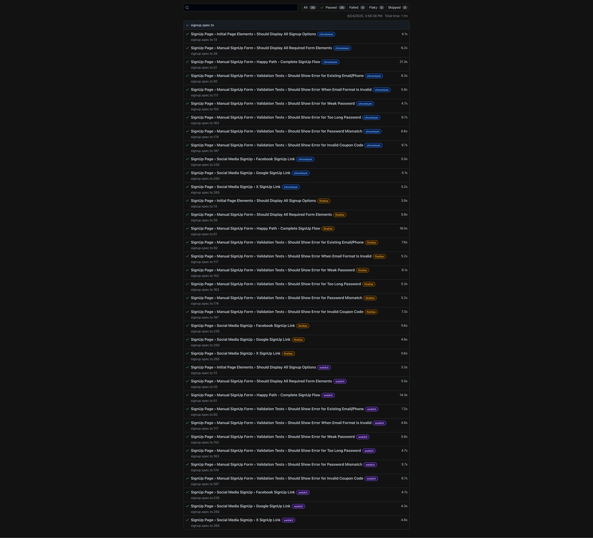

# BoxCommerce Test Automation

Automated testing suite for BoxCommerce signup functionality using Playwright.

## 🛠️ **Framework, Tools & Libraries**

### **Playwright**

- **Why**: Cross-browser automation with excellent reliability and debugging capabilities
- **Features**: Auto-waiting, network interception, mobile emulation, and parallel execution

### **TypeScript**

- **Why**: Type safety, better IDE support, and maintainable test code
- **Benefits**: Catches errors early, improves code quality

### **Node.js & npm**

- **Why**: JavaScript runtime and package management for Playwright ecosystem
- **Benefits**: Large ecosystem, easy dependency management

## 🚀 **Quick Start**

```bash
# Clone repository
git clone https://github.com/claramanik/BoxCommerce-Test-Automation.git
cd BoxCommerce-Test-Automation

# Install dependencies
npm install
npx playwright install

# Run tests
npm test
```

## 📊 **Viewing Test Results**

### **HTML Report**

After running tests, view detailed results:

```bash
# Run tests first
npx playwright test

# Then view the report
npx playwright show-report
```

### **Example Test Results**



_Note: This shows a sample Playwright HTML report. Your actual results will display your playwright-report folder._

## 🧪 **Test Coverage**

- **SignUp Form**: Complete signup flow, validation, error handling
- **Social Media**: Facebook, Google, and X integration tests
- **Form Validation**: Email format, password strength, coupon codes

## 📁 **Project Structure**

```
tests/
├── signup.spec.ts          # Main test file
└── utils/
    ├── signup.data.ts      # Test data & selectors
    └── generators.ts       # Unique data generation
```

## 🔧 **Running Tests**

```bash
# All tests
npm test

# Direct Playwright command
npx playwright test

# Parallel execution
npm run test:parallel

# Specific test
npx playwright test --grep="Happy Path"

# Debug mode
npm run test:debug
```

### **Handling Race Conditions**

If tests fail due to race conditions when running in parallel:

```bash
# Reduce workers to 1 for sequential execution
npx playwright test --workers=1
```

## 🐛 **Common Issues**

- **Tests fail in parallel**: Use `--workers=1` to run sequentially
- **Browser crashes**: Close other applications, reduce worker count
- **Element not found**: Check network connectivity, increase timeouts

## 📞 **Support**

- **Documentation**: [Playwright Docs](https://playwright.dev)
- **Issues**: Report bugs in GitHub repository
- **Community**: Join Playwright Discord

---

**Happy Testing! 🎉**
